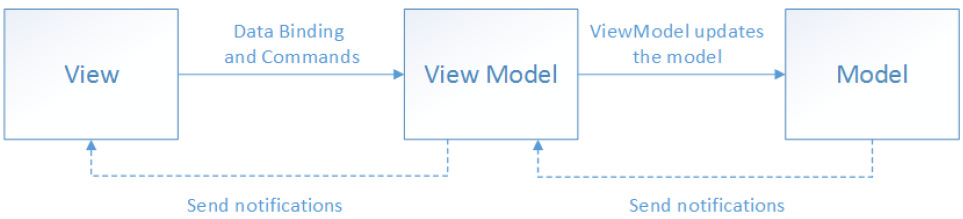

# The MVVM Partten -> Introduction

There are three core components in the MVVM pattern: the model, the view, and the view model. Each serves a distinct purpose. The diagram below shows the relationships between the three components.

In addition to understanding the responsibilities of each component, it’s also important to understand how they interact. At a high level, the view “knows about” the view model, and the view model “knows about” the model, but the model is unaware of the view model, and the view model is unaware of the view. Therefore, the view model isolates the view from the model, and allows the model to evolve independently of the view.

The benefits of using the MVVM pattern are as follows:

    - If an existing model implementation encapsulates existing business logic, it can be difficult or risky to change it. In this scenario, the view model acts as an adapter for the model classes and prevents you from making major changes to the model code.
    
    - Developers can create unit tests for the view model and the model, without using the view. The unit tests for the view model can exercise exactly the same functionality as used by the view.

    - The app UI can be redesigned without touching the view model and model code, provided that the view is implemented entirely in XAML or C#. Therefore, a new version of the view should work with the existing view model.

    - Designers and developers can work independently and concurrently on their components during development. Designers can focus on the view, while developers can work on the view model and model components.

The key to using MVVM effectively lies in understanding how to factor app code into the correct classes and how the classes interact. The following sections discuss the responsibilities of each of the classes in the MVVM pattern.